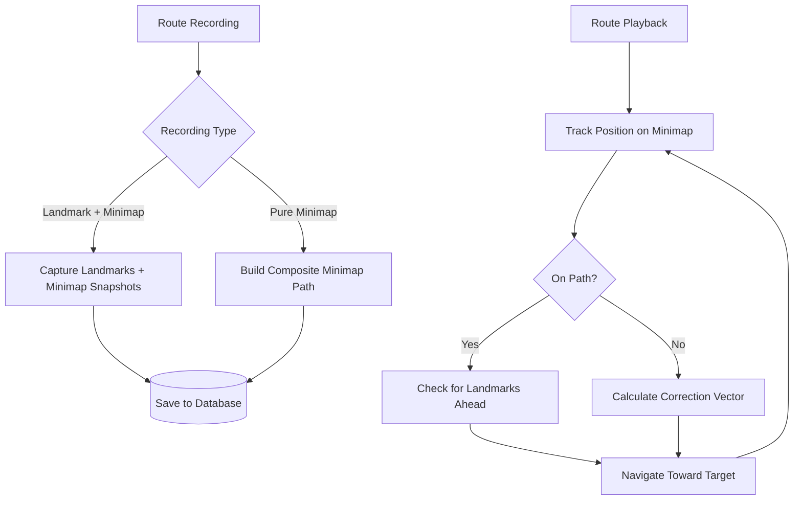

# Hybrid Navigation System Upgrade (gemini  3 pro plan)

## Problem Analysis

Your current system has two critical issues:

1. **Landmark System**: Template matching (`cv2.matchTemplate`) with simple normalized correlation is too sensitive to perspective/lighting changes, causing false positives (repetitive geometry) and false negatives (confidence drops from >0.8 to <0.7)
2. **Keylog System**: Pure time-based replay accumulates drift due to frame rate variations, input timing imprecision, and game physics inconsistencies

## Recommended Solution: Incremental Enhancement Starting with ORB Features

**Why Camera-Relative Minimap Justifies This Approach**:Your clarification about minimap behavior actually **strengthens** the case for focusing on ORB landmarks first:

1. **Minimap Complexity Higher Than Expected**:

- Camera-relative rotation means we can't directly compare positions
- Would need to track camera orientation OR do expensive feature matching on rotated minimaps
- This moves minimap tracking from "moderate" to "complex" territory

2. **ORB Solves Your Core Problem More Directly**:

- False positives/negatives are caused by template matching weakness
- ORB directly addresses this without minimap complexity
- Proven solution in computer vision literature

3. **Minimap Best Used as Validation, Not Primary Navigation**:

- Rotation handling adds significant implementation cost
- Better ROI to use minimap as coarse "sanity check"
- Keeps implementation in "moderate overhaul" range

**Recommended Phased Approach**:**Phase 1 (Core Fix)**: Enhanced Landmark System with ORB

- Primary focus: Fix false positive/negative issues with ORB feature matching
- Expected outcome: 80%+ of reliability problems solved
- Implementation complexity: Moderate
- No minimap tracking needed yet

**Phase 2 (Simple Enhancement)**: Minimap Validation

- Add coarse minimap similarity checking (using ORB, handles rotation naturally)
- Provides extra confidence without position tracking complexity
- Implementation complexity: Low (reuses ORB infrastructure)

**Phase 3 (If Needed)**: Full Minimap Position Tracking

- Only if Phase 1-2 don't meet reliability goals
- Implement camera-aware rotation normalization
- Implementation complexity: High (due to camera-relative behavior)

This approach combines the strengths of both systems while mitigating their weaknesses:




## Architecture Changes

### 1. New Component: MinimapTracker ([src/minimap-tracker.py](src/minimap-tracker.py))

**Purpose**: Extract and track player position/orientation from the minimap**CRITICAL: Minimap Rotation Behavior**:

- The minimap rotates based on **camera direction** (not player direction)
- When camera faces north → minimap shows north at top
- When camera faces south → minimap rotates 180° (south at top)
- Player indicator (diamond) shows player's facing relative to camera
- This means: minimap appearance changes completely with camera rotation

**Implications**:

- Cannot directly compare minimap positions without rotation normalization
- Need to track camera orientation alongside minimap snapshots
- Position tracking requires transforming camera-relative coords to world coords

**Key Features**:

- Extract minimap region (ROI at top-right: 960,0 to 1920,540)
- Detect player indicator (white diamond with cyan outline, always at minimap center)
- Extract player facing direction from diamond orientation
- **Calculate camera orientation** from minimap rotation (detect map features or use player diamond as reference)
- Store minimap frames with rotation data for normalization

**Technical Approach**:**Option A: Camera Orientation Tracking** (Recommended for moderate overhaul)

1. Extract minimap ROI
2. Detect player diamond orientation (gives player facing relative to camera)
3. During recording: Store camera orientation with each snapshot

- Can be inferred from: previous camera movements, landmark directions, or minimap feature matching

4. During playback: Normalize both recorded and current minimap to world coordinates

- Rotate current minimap by inverse of camera angle
- Compare normalized positions to detect drift

**Option B: Feature-Based Minimap Matching** (More robust but complex)

1. Extract terrain features from minimap (roads, boundaries, landmarks on map)
2. Use ORB/AKAZE to match current minimap against recorded minimap snapshots
3. Calculate translation + rotation between matches
4. Derive position and drift from feature correspondences
5. This naturally handles rotation but requires distinct minimap features

**Simplified Approach** (If above proves too complex):

- Use minimap only for coarse "sanity checking" (am I in the right general area?)
- Focus effort on improved landmark matching with ORB
- Minimap serves as safety net rather than primary navigation

**Why This Still Solves Drift**:

- Even with rotation complexity, minimap provides ground truth position
- Rotation normalization is a solvable problem (linear algebra transformation)
- Alternative: rely more on improved landmark matching, use minimap as validation

### 2. Enhanced Component: ImprovedVisionEngine ([src/vision.py](src/vision.py))

**Current Issue**: `cv2.matchTemplate` with `TM_CCOEFF_NORMED` is scale/rotation/lighting sensitive**Improvements**:

- Add **ORB (Oriented FAST and Rotated BRIEF)** feature detection as primary method
- Robust to rotation and scale changes
- Fast enough for real-time use
- Open-source (no patent issues like SIFT)
- Keep template matching as fallback for simple cases
- Add multi-scale matching (test at 0.8x, 1.0x, 1.2x scales)
- Implement temporal filtering (track landmark across frames to reduce jitter)

**Why This Solves False Positives/Negatives**:

- ORB detects keypoints (corners, edges) and creates descriptors
- Matches based on multiple keypoints, not just pixel correlation
- More resilient to lighting/perspective changes
- Can set minimum number of matching keypoints (e.g., 10+) to avoid false positives

### 3. Modified Component: MovementState ([src/states/movement.py](src/states/movement.py))

**Changes**:

- Add new route type: `"HYBRID"` (minimap + landmarks)
- Integrate minimap position tracking into playback loop
- Add drift detection and correction logic
- Modify navigation to use both minimap vectors and landmark centroid

**Navigation Logic**:

```javascript
1. Get current position from minimap
2. Compare to expected position on recorded path
3. If drift > threshold (e.g., 50 pixels):
   a. Calculate vector to nearest path point
   b. Navigate toward path + landmark (weighted blend)
4. Else:
   a. Navigate primarily toward landmark
```


### 4. Database Schema Updates ([src/db.py](src/db.py)) - Optional

**Optional Enhancement** (for minimap validation):

- Add `minimap_data` column to `step_images` table (nullable blob)
- Store minimap snapshot alongside each landmark image
- No new tables needed for Phase 1-5

**If Implementing Phase 6** (full position tracking):

- Create `minimap_snapshots` table
- Columns: `id`, `route_id`, `step_order`, `camera_orientation`, `image_data` (blob)
- Add `type='HYBRID_FULL'` route type

**For Phase 1-5**: No database changes strictly required

- Can store ORB features in memory (computed on-demand)
- Minimap snapshots optional (can be saved as separate files in landmarks folder)

## Implementation Plan

### Phase 1: Minimap Extraction & Tracking (Foundation)

**Files to Create**:

- `src/minimap-tracker.py` - New class `MinimapTracker`

**Key Methods**:

```python
def extract_minimap(image) -> np.ndarray
    """Extract minimap ROI from full screenshot"""

def detect_player_indicator(minimap_img) -> Optional[Tuple[float, float]]
    """Find player diamond on minimap, return angle of diamond orientation"""
    # Player is always at center, but diamond rotates to show facing
    
def estimate_camera_orientation(minimap_img, prev_orientation: float, camera_delta: Tuple[float, float]) -> float
    """Estimate world-space camera orientation from movement delta and minimap"""
    # Option 1: Track camera rotation from controller inputs
    # Option 2: Use minimap feature matching (if terrain features visible)
    
def normalize_minimap_to_world(minimap_img, camera_orientation: float) -> np.ndarray
    """Rotate minimap to world coordinates (north-up)"""
    
def get_relative_position(recorded_minimap, current_minimap, camera_then: float, camera_now: float) -> Tuple[float, float]
    """Calculate position difference accounting for rotation"""
    # 1. Normalize both minimaps to world coords
    # 2. Use feature matching or optical flow to find translation
    # 3. Return (dx, dy) in world space
```

**Testing Approach**:

- Capture 100 frames while rotating camera 360° in place
- Verify minimap rotates correctly
- Confirm player diamond stays centered but rotates
- Walk in straight line while varying camera angle
- Test position extraction with different camera orientations
- Verify world-coordinate normalization works
- Test feature matching on minimap terrain (if pursuing Option B)

### Phase 2: Improved Feature Detection (PRIMARY FIX)

**Files to Modify**:

- [src/vision.py](src/vision.py) - Add ORB feature matching capabilities

**Key Methods**:

```python
def load_template_with_features(name: str, path: str):
    """Load template image and pre-compute ORB features for it"""
    # Store both image and (keypoints, descriptors) in self.templates
    
def find_template_orb(template_name: str, image: np.ndarray, min_matches: int = 10, roi: Optional[Tuple] = None) -> Optional[Tuple[int, int, float]]:
    """Find template using ORB feature matching"""
    # 1. Extract ORB features from search region
    # 2. Match against template features using BFMatcher
    # 3. Filter matches with Lowe's ratio test
    # 4. If matches >= min_matches, compute homography
    # 5. Return center position + confidence (based on # of matches)
    
def find_template_hybrid(template_name: str, image: np.ndarray, threshold: float = 0.8, min_matches: int = 10, roi: Optional[Tuple] = None) -> Optional[Tuple[int, int, float]]:
    """Try ORB first, fall back to template matching if needed"""
    # 1. Try ORB (handles rotation, scale, lighting)
    # 2. If ORB fails (< min_matches), try template matching
    # 3. Return best result
```

**ORB Configuration**:

- `nfeatures=500`: Good balance of speed vs. accuracy
- `scaleFactor=1.2`: Test at multiple scales (handles size variation)
- `nlevels=8`: Pyramid levels for multi-scale detection
- `edgeThreshold=15`: Ignore edges of search region
- `patchSize=31`: Keypoint descriptor size

**Fallback Strategy**:

- Try ORB first (fast, robust to rotation/lighting/scale)
- If ORB fails (< min_matches), fall back to template matching
- If both fail, enter seek mode (existing logic)

**Expected Improvements**:

- False positives: ORB requires 10+ distinct keypoint matches (vs. single correlation score)
- False negatives: ORB handles ±20° rotation, ±20% scale, lighting variation
- Repetitive geometry: ORB matches unique corner patterns, not just texture

### Phase 2.5: Simplified Minimap Validation (Optional Enhancement)

**Files to Modify**:

- [src/vision.py](src/vision.py) - Add minimap extraction utility

**Purpose**: Use minimap as coarse validation WITHOUT full position tracking**Approach**:

- During recording: Capture minimap snapshot with each landmark
- During playback: Compare current minimap to recorded minimap using feature matching
- If similarity is low, trigger "lost" state and enter seek mode
- If similarity is high, continue landmark-based navigation

**Key Method**:

```python
def compare_minimap_regions(recorded_minimap: np.ndarray, current_minimap: np.ndarray) -> float:
    """Compare two minimap images, return similarity score (0-1)"""
    # Use ORB feature matching on minimap terrain features
    # Return ratio of good matches to expected matches
    # Accounts for rotation by using ORB
```

**Benefits**:

- Avoids complex rotation normalization and position tracking
- Provides coarse "am I in the right area?" check
- Low computational overhead (same ORB we're already using)
- Easy to implement (reuse ORB infrastructure)

**Limitation**:

- Doesn't provide drift correction vector (just yes/no validation)
- But combined with improved ORB landmarks, should be sufficient

### Phase 3: Enhanced Recording Mode

**Files to Modify**:

- [src/states/movement.py](src/states/movement.py) - Update recording flow

**Recording Flow** (Minimal changes):

1. User presses `r` → selects route type
2. Keep existing options, possibly rename "Landmark" to "Enhanced Landmark"
3. During recording:

- When user presses `t`: Capture landmark (as before)
- **NEW**: Also capture minimap snapshot for validation (optional)
- Store both using ORB-enhanced templates

4. Save to database: Landmark images (with pre-computed ORB features) + optional minimap snapshots

### Phase 4: Enhanced Playback Mode

**Files to Modify**:

- [src/states/movement.py](src/states/movement.py) - Update `handle_playback` method

**Playback Flow** (Simplified approach focusing on ORB):

```python
def handle_playback(self, image):
    """Enhanced playback using ORB feature matching"""
    
    # 1. Find current landmark using ORB (with template matching fallback)
    match = self.vision.find_template_hybrid(
        template_name=current_landmark,
        image=image,
        threshold=0.75,  # Lower threshold OK since ORB is more robust
        min_matches=10,
        roi=self.get_search_roi()  # Optimized ROI based on last position
    )
    
    # 2. Optional: Validate we're in right area using minimap
    if self.landmarks[self.current_landmark_idx].get('minimap_snapshot'):
        minimap_current = self.vision.extract_minimap(image)
        minimap_recorded = self.landmarks[self.current_landmark_idx]['minimap_snapshot']
        similarity = self.vision.compare_minimap_regions(minimap_recorded, minimap_current)
        
        if similarity < 0.3:  # Very lost
            print(f"[WARN] Minimap validation failed (similarity: {similarity:.2f}). May be off-path.")
            # Could trigger seek or request user intervention
    
    # 3. Navigate toward landmark (existing logic, unchanged)
    if match:
        # Center landmark, move forward (existing code)
        self.navigate_to_match(match)
    else:
        # Enter seek mode (existing code)
        self.execute_seek()
```

**Key Changes from Current System**:

1. Replace `find_template()` with `find_template_hybrid()` (ORB + fallback)
2. Add optional minimap validation check
3. Keep existing navigation logic (camera tracking, movement, seek behavior)
4. No complex position tracking or drift correction needed

**Why This Works**:

- ORB solves the false positive/negative problem (main issue)
- Minimap validation provides extra confidence check
- Existing seek/recovery logic handles temporary failures
- Minimal disruption to working parts of current system

### Phase 5: Testing & Refinement

**Test Routes**:

1. Simple straight path (verify no regression)
2. Complex path with multiple turns (test drift correction)
3. Path with repetitive geometry (test false positive reduction)
4. Path with lighting changes (test ORB robustness)

**Success Criteria**:

- Complete 5/5 simple routes without intervention
- Complete 4/5 complex routes with < 2 drift corrections needed
- Zero false positive landmark matches on repetitive geometry test

## Migration Path

**For Existing Routes**:

- Landmark routes continue working (no breaking changes)
- Keylog routes continue working (no breaking changes)
- User can re-record critical routes as HYBRID for better reliability

**Backward Compatibility**:

- Keep existing `route_type` values: `"LANDMARK"`, `"KEYLOG"`
- Add new value: `"HYBRID"`
- Old playback logic remains in `handle_playback()` and `handle_keylog_playback()`
- New logic in `handle_hybrid_playback()`

## Technical Considerations

**Performance**:

- ORB feature detection: ~10-20ms per frame (acceptable for 30 FPS)
- Minimap extraction: ~2-5ms per frame
- Total overhead: ~15-25ms (maintains 30+ FPS)

**Robustness**:

- Minimap provides ground truth position (no accumulated error)
- Feature matching reduces false positives (require multiple keypoint matches)
- Weighted blending allows graceful degradation (if landmarks fail, minimap guides)

**Limitations**:

- Requires minimap to be visible (won't work in cutscenes/battles)
- Minimap rotation still needs handling (can normalize during extraction)
- Composite map building needs memory management (compress old snapshots)

## File Structure

```javascript
src/
├── minimap-tracker.py       [NEW] - Minimap extraction and tracking
├── vision.py                 [MODIFY] - Add ORB feature matching
├── states/
│   └── movement.py           [MODIFY] - Add hybrid recording/playback
├── db.py                     [MODIFY] - Add minimap_snapshots table
└── controller.py             [NO CHANGE]
```


## Expected Outcomes

1. **Drift Reduction**: Minimap tracking provides continuous position feedback, eliminating accumulated error
2. **False Positive Reduction**: ORB requires 10+ keypoint matches vs. single correlation score
3. **False Negative Reduction**: ORB robust to 15-20° rotation and 20% scale changes
4. **Reliability**: Weighted blending means system can navigate even if landmarks occasionally fail
5. **Complex Route Support**: Continuous drift correction enables longer, more complex routes

## Phase 6: Full Minimap Position Tracking (Optional - Only if Phase 1-5 Insufficient)

If ORB landmark improvements + minimap validation still don't provide sufficient reliability, we can implement full position tracking:**Approach**: Camera-Aware Position Tracking

1. Track camera orientation during recording (from controller inputs or landmark directions)
2. Store camera orientation with each minimap snapshot
3. During playback, normalize both current and recorded minimaps to world coordinates
4. Use feature matching or optical flow on normalized minimaps to calculate position drift
5. Blend landmark navigation with drift correction vector

**Implementation Complexity**: High

- Requires rotation matrix transformations
- Need to handle gimbal lock and orientation discontinuities
- Memory intensive (store full minimap snapshots)
- More CPU intensive (rotation + feature matching per frame)

**Alternative**: Pure Minimap SLAM

- Build composite world map from all minimap snapshots
- Use visual SLAM techniques to localize within composite
- Navigate by following recorded path on composite map
- Most robust but most complex

**Recommendation**:

- Start with Phase 1-5 (ORB landmarks + minimap validation)
- Evaluate results on your actual routes
- Only implement Phase 6 if ORB improvements prove insufficient
- Based on research, ORB feature matching solves most template matching issues (rotation, scale, lighting)
- The camera-relative minimap rotation adds significant complexity that may not be needed

## Summary of Incremental Approach

**Phase 1-2** (Core Fix): ORB feature matching for landmarks

- Solves false positives (requires multiple keypoint matches)
- Solves false negatives (robust to rotation/lighting/scale)
- Minimal changes to existing system

**Phase 2.5-4** (Moderate Enhancement): Add minimap validation

- Provides coarse "am I lost?" check
- Low complexity (reuse ORB infrastructure)
- Optional feature, not critical path